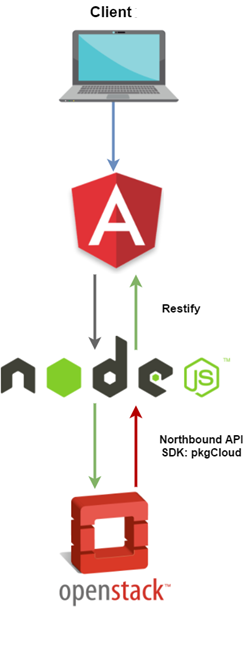
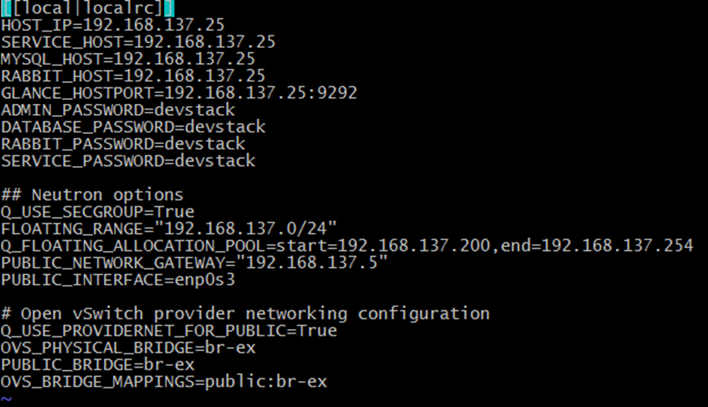

# SDN-OpenStack-App

Small project for resource orchestration of network infrastructures, by implementing different technologies to benefit from OpenStack NOVA and NEUTRON services. Also using Angular and NodeJS to create a resilient web platform that will able users to authenticate and create networks and instances for their own use.

## Implementation

## OpenStack and OpenVSwitch

### Example of `local.conf`  

